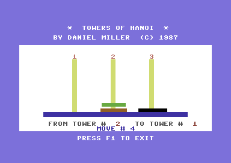

{:.inline }

The idea of this exercise is to graphically implement the *Tower of Hanoi*
puzzle. For a description of the puzzle we refer to [Wikipedia]. Make sure you
have understood the Pygame basics, written a *design document*, as well as
practiced a little bit with drawing shapes on the screen before getting started. Your first lab session will consist of these activities.

[Wikipedia]: http://en.wikipedia.org/wiki/Towers_of_hanoi

## Learn PyGame

Fortunately, PyGame is already installed in the Appliance. (If you are not using the Appliance, please make sure PyGame is running well *before* coming to class. It will take you some time. If you get in trouble, install the Appliance.) To get you started, follow along with the [Pygame Basics](http://inventwithpython.com/pygame/chapter2.html) book chapter (up until the "Animation" paragraph), and try out PyGame.

To make your program work well, you will need to insert this line at the bottom of the game loop:

	pygame.time.wait(10)

This line will allow other programs than your game to use the processor. This includes stuff like gEdit, so it's nice to have that line!

## Required features of your game

Back to our assignment. Here are the features that your game should provide for the user!

* Graphically represent any state in the Tower of Hanoi puzzle.
* Move discs between towers using the mouse.
* Detect when the game is solved.
* Prevent illegal moves.
* Read a starting state from file like [this one](hanoi.txt). Each line is a
  tower and larger numbers represent larger discs.

## Steps

* During the *first lab session* you will create a design document that, er, documents all design decisions you can come up with.
* At the *end of the first week*, you will have finished a beta version of
  your game.
* At the *end of the second week*, you will have finished the final version of
  your game.

Need some help? Try the [Pygame.event Reference](http://www.pygame.org/docs/ref/event.html) (a list of possible event types and their attributes).
